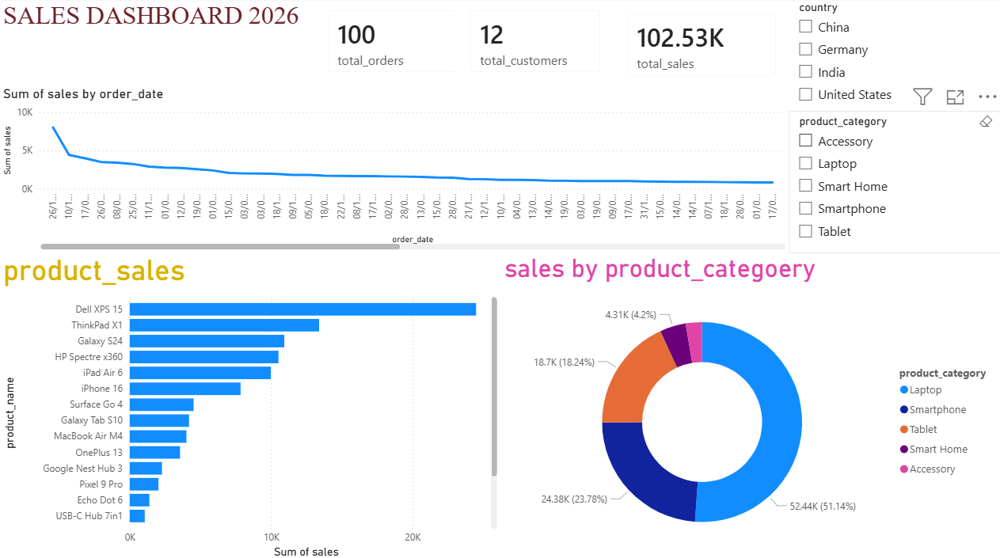

# 📊 Sales Dashboard Project - Power BI

## Project Overview

This project is an interactive Sales Dashboard built using Power BI. The dashboard provides insights into product sales performance, order volume, and product category contributions. The objective of this project is to demonstrate data cleaning, data modeling, visualization, and dashboard design skills used in real-world business intelligence projects.

---

## Dashboard Preview

(Add dashboard screenshot here)

---

## Business Problem

Organizations need a quick way to monitor sales performance and identify top-performing products and categories. This dashboard helps stakeholders:

* Track total orders
* Analyze sales by product
* Compare sales across product categories
* Identify best-selling products
* Monitor business performance through KPIs

---

## Dataset Information

### Customers Table

* customer_id
* customer_name
* city
* state
* country
* score

### Orders Table

* order_id
* order_date
* customer_id
* product_name
* product_category
* quantity
* sales

---

## Data Preparation

Performed the following data cleaning tasks:

* Converted data types
* Fixed date format issues
* Handled null values
* Validated relationships between tables
* Removed unnecessary columns where required

---

## Data Modeling

Relationship Created:

customers (1) ---------> (*) orders

Primary Key:

* customers.customer_id

Foreign Key:

* orders.customer_id

Relationship Type:

* One-to-Many

---

## Dashboard Features

### KPI Card

* Total Orders

### Product Sales Analysis

* Sales by Product Name
* Top Performing Products

### Category Analysis

* Sales by Product Category
* Percentage Contribution of Each Category

---

## Power BI Concepts Used

* Data Modeling
* Relationships
* Power Query
* Data Transformation
* DAX Measures
* Card Visuals
* Bar Charts
* Donut Charts
* Dashboard Design

---

## Key Insights

* Laptop category generates the highest sales.
* Smartphone category is the second-largest contributor.
* Certain products contribute significantly more revenue than others.
* Sales distribution varies across product categories.

---

## Tools & Technologies

* Power BI Desktop
* Power Query
* DAX
* GitHub

---

## Project Files

* sales_dashboard.pbix
* dashboard.png
* README.md

---

## Author

Sanjay Alavala

Aspiring Data Analyst | Power BI | SQL | Python | Data Visualization
